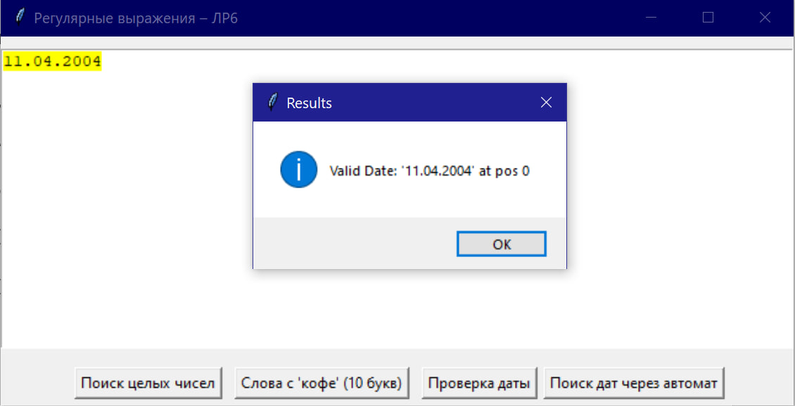
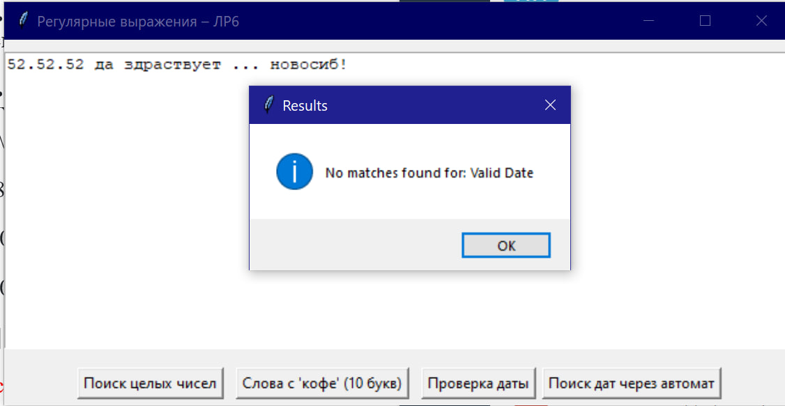
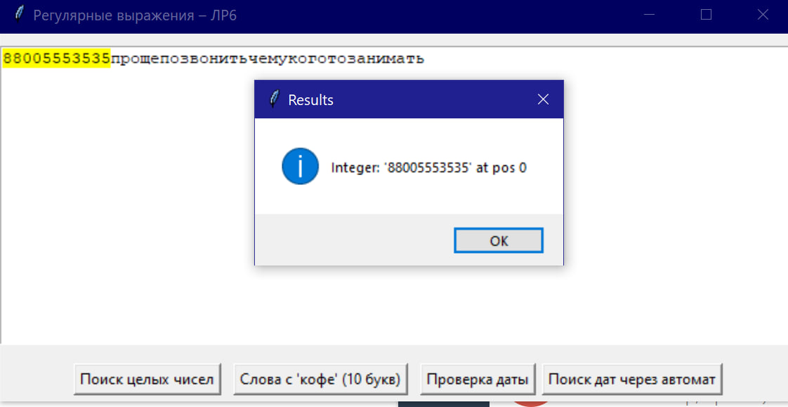
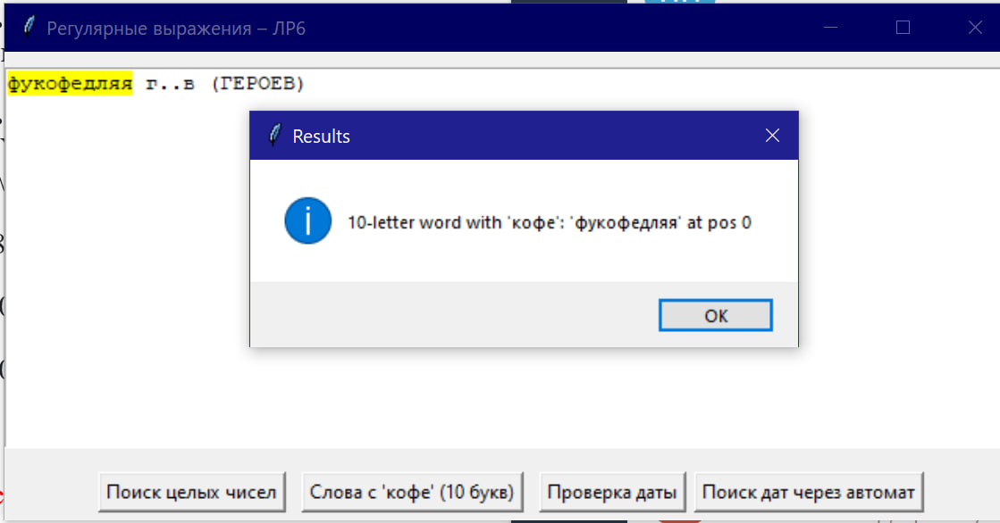
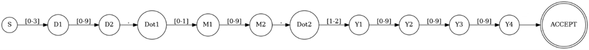

# Регулярные выражения (РВ)

## Задачи

### ✅ 1. Построить РВ, описывающее целое число (положительное или отрицательное)

**Шаблон:**

```regex
r"[-+]?\d+"
```

**Назначение:**
Распознаёт как положительные, так и отрицательные целые числа. Допускается необязательный знак `+` или `-` перед числом.

---

### ✅ 2. Построить РВ для проверки слов, содержащих подстроку “кофе” и имеющих ровно 10 символов

**Шаблон:**

```regex
r"(?=\b\w{10}\b)\w*кофе\w*"
```

**Назначение:**
Находит слова длиной ровно 10 символов, в составе которых присутствует подстрока `кофе`.

---

### ✅ 3. Построить РВ для проверки даты в формате `DD.MM.YYYY` с учётом високосных годов

**Шаблон:**

```regex
r"(?:29\.02\.(?:\d\d(?:0[48]|[2468][048]|[13579][26])|(?:[02468][048]00|[13579][26]00)))|(?:31\.(?:01|03|05|07|08|10|12)\.\d{4})|(?:30\.(?:04|06|09|11)\.\d{4})|(?:0[1-9]|1\d|2[0-8])\.(?:0[1-9]|1[0-2])\.\d{4}"
```

**Назначение:**
Проверка корректности дат в формате `дд.мм.гггг`:

* Учитываются месяцы с разным числом дней,
* Обрабатываются високосные годы,
* Исключены некорректные даты (например, 31.02.2021).

---

## Скриншоты

1. 
2. 
3. 
4. 

---

## Дополнительное задание

* 
